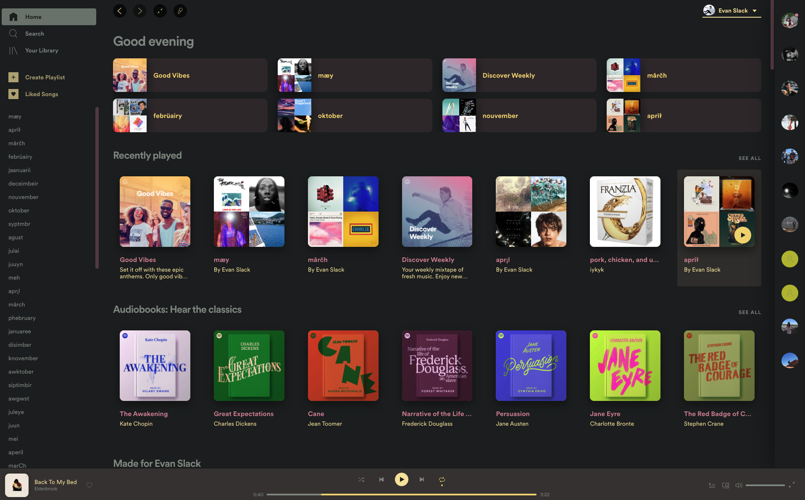
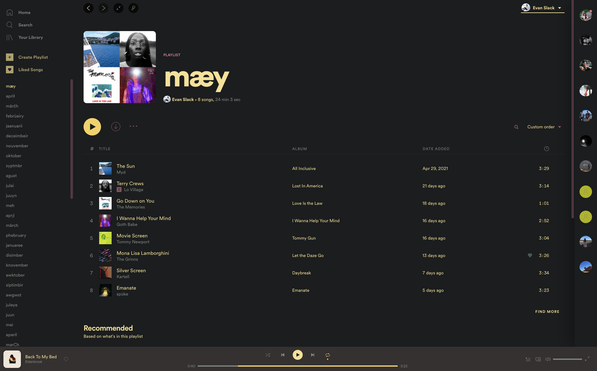

# yellowDays

#### A simple theme for spotify

## Screenshots




## About
A simple spicetify theme with slight tweaks to the exsisting [Onepunch](https://github.com/morpheusthewhite/spicetify-themes/tree/v2/Onepunch) theme. 

## Usage
Install [spicetify](https://github.com/khanhas/spicetify-cli), migrate to /spicetify_data/themes, and copy these files over. To install, run the following in terminal: 

```bash
spicetify config current_theme yellowDays
```
Then select either dark or light mode with

```bash
spicetify config color_scheme dark
```

```bash
spicetify update
```


